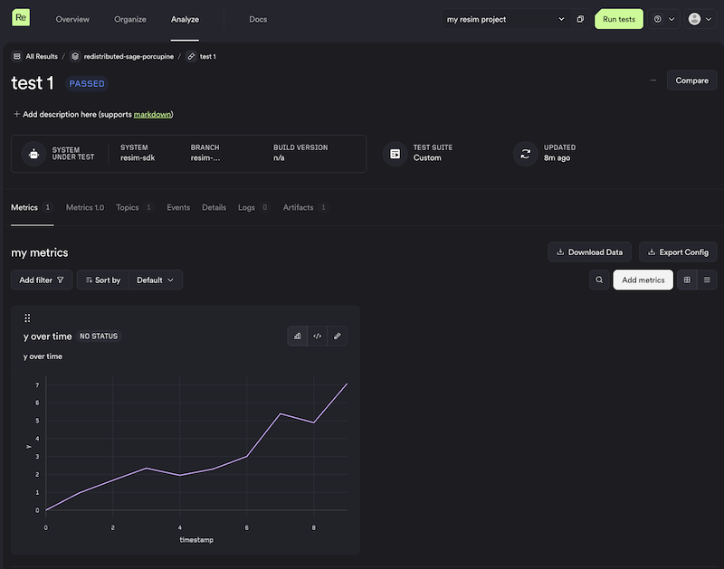

# Running Tests Outside of ReSim

This repo demonstrates how to run tests outside of ReSim and produce metrics on the results. This is useful when you do not have a dockerized build ready for running in our cloud.

Using the ReSim Python SDK lets you still use the ReSim metrics system to analyze data from your tests.

## Setup

The [resim-sdk](https://pypi.org/project/resim-sdk/) package requires Python >= 3.10.

Install dependencies:

```bash
pip install -r requirements.txt
# or, if using uv
uv sync
```

## Running the Example

1. If you do not yet have a project in ReSim, either:
   - Visit <https://app.resim.ai/projects/create> to create one, or
   - Use the [ReSim CLI](https://github.com/resim-ai/api-client#installation) to [create a project](https://docs.resim.ai/setup/projects/).
1. Update `PROJECT_NAME` in `main.py` to point to the project you created above.
1. Run the script via `python main.py` or `uv run main.py`:

   ```bash
   $ uv run main.py
   Authenticating by Device Code

   Please navigate to: https://resim.us.auth0.com/activate?user_code=XXXX-XXXX

   Created batch recreant-pear-gayal with id 13264aff-ccc2-43e2-9884-462ff33417f9
   test 1 done
   test 2 done
   Batch done. After a few minutes, you can view your metrics here: https://app.resim.ai/projects/XXXXXXXX-XXXX-XXXX-XXXX-XXXXXXXXXXXX/batches/13264aff-ccc2-43e2-9884-462ff33417f9
   ```

**Note:** The first time you run the script, you will need to visit the displayed URL to authenticate.

The script exits once test data has been uploaded. Metrics processing begins automatically — allow a few minutes for results to appear. Once available, you can:

- edit existing metrics to refine your analysis
- add new metrics
- view the raw data emitted by the tests under the "Artifacts" tab for each test

See the [metrics documentation](https://docs.resim.ai/guides/metrics-2/) for more information.



## Running Tests Without Interactive Authentication

If you intend to run this inside of a CI system you will want a non-interactive authentication flow. You can achieve this by using `UsernamePasswordClient` instead of the `DeviceCodeClient` used in the example. You can contact ReSim to obtain your credentials. You should store the username/password as secrets in your CI workflow.

```python
from resim.sdk.auth.username_password_client import UsernamePasswordClient
...
client = UsernamePasswordClient(username="*****", password="*****")
```
